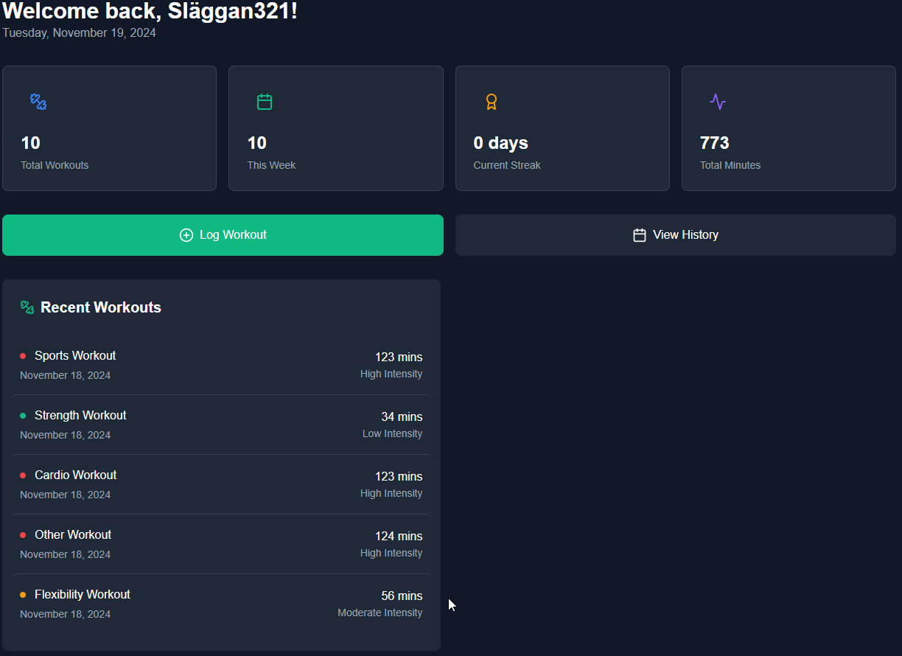
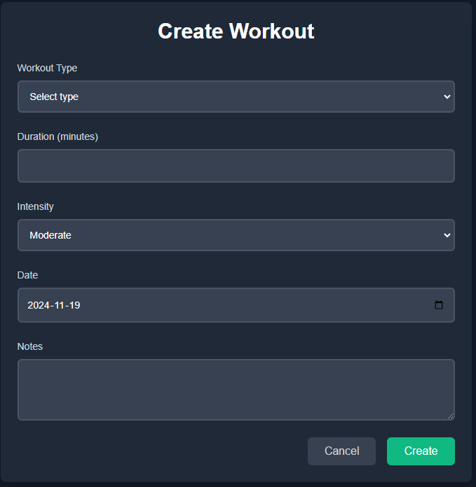
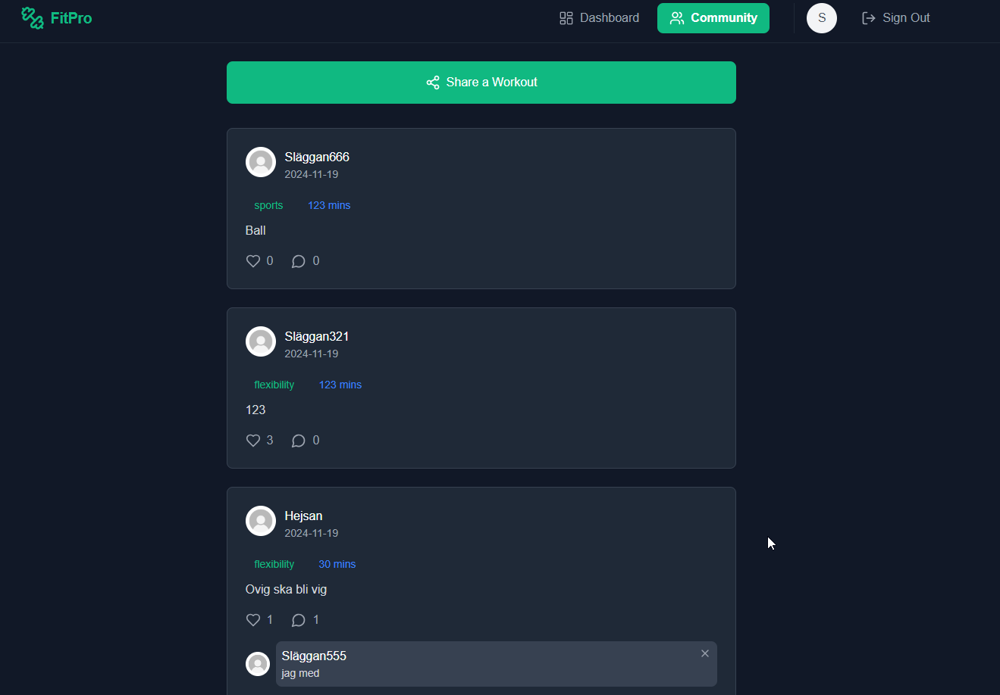

# FitPro Frontend Application

FitPro Frontend Application
Welcome to FitPro, a comprehensive fitness tracking platform designed to help users stay on top of their workouts, monitor progress, and engage with a supportive community. Whether you're a fitness enthusiast, personal trainer, or someone looking to improve their health, this application provides the tools and features necessary to manage your fitness goals efficiently. With a focus on intuitive design and user experience, FitPro is your reliable partner in achieving and tracking your fitness milestones.

[](https://reactjs.org/)
[](https://getbootstrap.com/)
[](LICENSE)

## Project Goals & Strategy

### Primary Goals

- Create an intuitive fitness tracking interface
- Enable social interaction between users
- Provide visual progress tracking
- Ensure mobile-first, responsive design
- Maintain high performance and accessibility

### Target Audience

- Fitness enthusiasts
- Personal trainers
- Gym-goers
- Health-conscious individuals

### User Story Prioritization

- Must Have (Core functionality)
- Should Have (Important features)
- Could Have (Nice to have features)
- Won't Have (Future considerations)

[View Project Board](https://github.com/users/OscarBackman92/projects/11/views/1)

## Design & UX

### Color Scheme

Primary Colors:

- Brand Green: `#10B981`
- Dark Background: `#1F2937`
- Light Text: `#F9FAFB`
- Accent Blue: `#3B82F6`

### Typography

- Primary Font: Inter (Headers)

```css
@import url('https://fonts.googleapis.com/css2?family=Inter:wght@400;500;600;700&display=swap');

```

- Secondary Font: Open Sans (Body)

```css
@import url('https://fonts.googleapis.com/css2?family=Open+Sans:wght@400;600&display=swap');
```

## Features with Screenshots

### Authentication

- User registration


- Login/Logout

- Password reset

- JWT token management

### Dashboard



- Workout summary
- Recent activities
- Quick actions

### Workout Tracking



- Create workouts
- Track duration & intensity
- Add notes
- View history

### Social Features



- Activity feed
- Like & comment
- Share workouts

## Installation & Setup

### Prerequisites

- Node.js (v18.x+)
- npm (v9.x+)
- Git

### Installation Steps

```bash
# Clone repository
git clone https://github.com/OscarBackman92/FitPro

# Install dependencies
npm install

# Setup environment
cp .env.example .env.local
# Edit .env.local with your values

# Start development server
npm start
```

### Required Packages

```json
{
  "dependencies": {
    "@emotion/react": "^11.13.3",
    "@emotion/styled": "^11.13.0",
    "axios": "^1.7.7",
    "date-fns": "^2.30.0",
    "jwt-decode": "^4.0.0",
    "react": "^18.3.1",
    "react-router-dom": "^6.27.0",
    "recharts": "^2.13.3"
  }
}
```

## Cross-Browser Compatibility

Tested on:
| Browser | Version | Status |

|---------|---------|---------|
| Chrome  | 120.0   | ✅ Pass |
| Firefox | 119.0   | ✅ Pass |
| Safari  | 17.0    | ✅ Pass |
| Edge    | 120.0   | ✅ Pass |

## Accessibility

- WCAG 2.1 AA compliant
- Semantic HTML
- ARIA labels
- Keyboard navigation
- Color contrast ratios
- Screen reader testing

### Lighthouse Scores

- See testing file for lighthouse scores.
- [TESTING.md](TESTING.md)

## Known Bugs & Future Improvements

### Known bugs

1. Profile image upload is failing, the code is there for it but due to time constraints debugging it is pushed forward
2. Goal tracking feature incomplete and not implemented.
3. If one user goes to another users profile. in recent workouts, the user that is visiting the profiles workouts is shown.
4. Adding your weight and height in profile the "keyboard" stops working and you're only allowed to write one number at a time
5. On phone the birth date shows funky.
6. Member since date is invalid, don't know why.
7. workout search and filter ise'nt working
8. pictures missing from home and about pages.
9. Reset password is not working.
10. no terms of service and therefor 404 error.
11. When you logout and want to login again you have to refresh the login page. otherwise its you cant login. Very annoying and i dont know why.

### Planned Improvements

1. Dark mode implementation
2. Push notifications
3. Offline support
4. Performance optimizations
5. Enhanced analytics
6. Every known bug.

## CORS & Security

### CORS Configuration

```javascript
// axios configuration
axios.defaults.baseURL = process.env.REACT_APP_API_URL;
axios.defaults.withCredentials = true;
axios.defaults.headers.post['Content-Type'] = 'application/json';
```

### Security Measures

- JWT token refresh
- XSS prevention
- CSRF protection
- Secure cookie handling

## Tools & Technologies

### Core Technologies

- React 18.3.1
- React Router 6.27.0
- Axios 1.7.7
- React Query
- Tailwind CSS
- Recharts

### Development Tools

- ESLint
- Prettier
- Husky
- Jest
- React Testing Library
- Cypress

### Design Tools

- Figma
- Adobe XD
- Lucide Icons

## Credits

### Code Resources

- React Documentation
- React Router Documentation
- JavaScript.info
- CSS-Tricks
- Stack Overflow solutions

### Tools & Libraries

- React Bootstrap
- React Icons
- React Toastify
- React Hot Toast
- Date-fns
- Tailwind CSS

### Tutorials

- Code Institute's React Module

## Acknowledgments

Special thanks to:

- Code Institute tutors
- Mentor Daisy
- Testing team/family
- Fellow developers who provided feedback
- Myself for not giving up and continuing pushing forward and testing myself and my capabilities.

## License

This project is licensed under the MIT License - see the [LICENSE](LICENSE) file for details.

---
For testing documentation, visit the [TESTING.md](TESTING.md).
Live site is here:

(https://frontendfitness-e0476c66fecb.herokuapp.com/)
