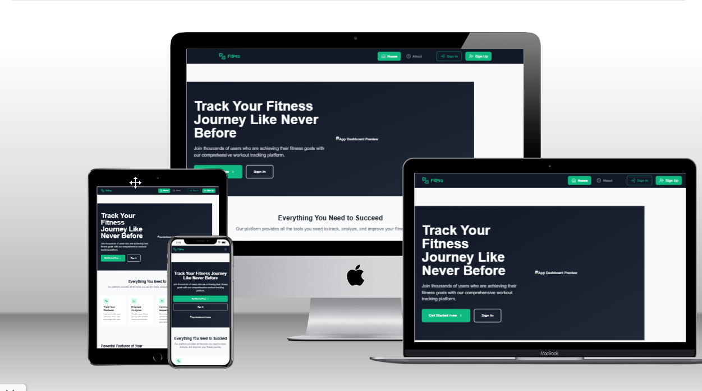

# FitPro - React Fitness Tracking Application

[](LICENSE)
[](https://reactjs.org/)
[](https://nodejs.org)
[](https://coverage.readthedocs.io/)



## Table of Contents

1. [Description](#description)
2. [Live Site](#live-site)
3. [Features](#features)
4. [User Interface](#user-interface)
5. [User Stories](#user-stories)
6. [Technology Stack](#technology-stack)
7. [Installation](#installation)
8. [Usage](#usage)
9. [Configuration](#configuration)
10. [Components](#components)
11. [Testing](#testing)
12. [Deployment](#deployment)
13. [License](#license)
14. [Contact](#contact)

## Description

FitPro revolutionizes fitness tracking by providing a comprehensive platform for workout management, progress tracking, and social fitness interaction. Built with React and modern web technologies, it offers an intuitive interface for users to track their fitness journey and connect with like-minded individuals.

### Core Benefits

- 📊 Visual progress tracking with interactive charts
- 🏋️ Comprehensive workout logging system
- 🎯 Goal setting and achievement tracking
- 👥 Social fitness community features
- 📱 Responsive design for all devices
- 🔒 Secure user authentication

## Live Site

- **Live Site**: [https://frontendfitness-e0476c66fecb.herokuapp.com/](https://frontendfitness-e0476c66fecb.herokuapp.com/)

## Features

### 1. User Authentication & Profile Management

#### Secure Authentication System

- Email and password registration
- Social media authentication (Google, Facebook)
- Two-factor authentication option
- Secure password reset flow

[AUTH SCREENSHOT: Add authentication screens collage - recommended size 800x400px]

#### Profile Customization

- Personal information management
- Profile picture upload with Cloudinary integration
- Fitness goal setting
- Privacy settings management

[PROFILE SCREENSHOT: Add profile page screenshot - recommended size 800x400px]

### 2. Workout Tracking System

#### Workout Logging

- Multiple workout types support:
  - Cardio
  - Strength Training
  - Flexibility
  - Sports
  - Custom workouts
- Detailed workout parameters:
  - Duration
  - Intensity
  - Sets and reps
  - Notes and images
- Quick-log functionality

[WORKOUT FORM SCREENSHOT: Add workout logging interface - recommended size 800x400px]

#### Workout History

- Calendar view of workouts
- List view with filtering options
- Detailed workout statistics
- Export functionality (CSV, PDF)

[WORKOUT HISTORY SCREENSHOT: Add workout history view - recommended size 800x400px]

### 3. Progress Visualization

#### Interactive Charts

- Workout frequency trends
- Duration analysis
- Intensity distribution
- Custom date range selection

[CHARTS SCREENSHOT: Add progress charts display - recommended size 800x400px]

#### Statistics Dashboard

- Weekly/monthly/yearly comparisons
- Personal records tracking
- Goal completion rates
- Activity streaks

[DASHBOARD SCREENSHOT: Add statistics dashboard - recommended size 800x400px]

### 4. Social Features

#### Community Interaction

- Follow other users
- Activity feed
- Workout sharing
- Achievement celebrations

[SOCIAL FEATURES SCREENSHOT: Add social interface elements - recommended size 800x400px]

#### Social Engagement

- Like and comment on workouts
- Share achievements
- Create and join fitness challenges
- Direct messaging between users

[ENGAGEMENT FEATURES SCREENSHOT: Add engagement features - recommended size 800x400px]

## User Interface

### Responsive Design

The application is fully responsive and optimized for:

- Desktop (1200px+)
- Tablet (768px - 1199px)
- Mobile (320px - 767px)

[RESPONSIVE DESIGN SHOWCASE: Add responsive design demonstration - recommended size 1200x400px]

### Theme and Accessibility

- Dark/Light mode support
- High contrast options
- Screen reader compatibility
- Keyboard navigation support

[THEME SCREENSHOTS: Add theme variations showcase - recommended size 800x400px]

## User Stories

[Existing user stories content remains the same, but now organized with visual elements]

### Epic 1: Authentication & Profile Management

[AUTH FLOW DIAGRAM: Add authentication flow diagram - recommended size 600x300px]

[Previous user stories content...]

### Epic 2: Workout Management

[WORKOUT FLOW DIAGRAM: Add workout management flow diagram - recommended size 600x300px]

[Previous user stories content...]

## Technology Stack

### Frontend

- React 18.3.1
- React Router 6.27.0
- Tailwind CSS
- Recharts for data visualization
- Lucide React for icons

### State Management

- React Context API
- Custom hooks for state management

### Testing

- Jest
- React Testing Library
- Cypress for E2E testing

[TECH STACK DIAGRAM: Add technology stack visualization - recommended size 800x400px]

## Installation

### Prerequisites

- Node.js 18.x or higher
- npm 9.x or higher
- Git

[PREREQUISITES SCREENSHOT: Add installation prerequisites - recommended size 600x300px]

[Previous installation content...]

## Development Environment Setup

### Editor Configuration

```json
{
  "editor.formatOnSave": true,
  "editor.defaultFormatter": "esbenp.prettier-vscode",
  "editor.codeActionsOnSave": {
    "source.fixAll.eslint": true
  }
}
```

### Recommended VS Code Extensions

- ESLint
- Prettier
- Tailwind CSS IntelliSense
- ES7+ React/Redux/React-Native snippets

[EDITOR SETUP SCREENSHOT: Add editor configuration - recommended size 600x300px]

## Deployment

### Production Build

```bash
npm run build
```

### Deployment Platforms

- Heroku

## Contributing

### Development Workflow

1. Fork the repository
2. Create a feature branch
3. Commit changes
4. Push to the branch
5. Create a Pull Request

### Code Style Guide

- Follow ESLint configuration
- Use Prettier for formatting
- Follow component naming conventions
- Maintain proper documentation

[CODE STYLE SCREENSHOT: Add code style examples - recommended size 600x300px]

## License

This project is licensed under the MIT License - see the [LICENSE](LICENSE) file for details.

## Contact & Support

### Contact Information

- Website: [Your Website]

- Email: support@fitpro.com

- Twitter: [@fitpro](https://twitter.com/fitpro)

- LinkedIn: [FitPro](https://linkedin.com/company/fitpro)

### Support Channels

- GitHub Issues
- Documentation
---

[FOOTER BANNER: Add project footer banner - recommended size 1200x100px]